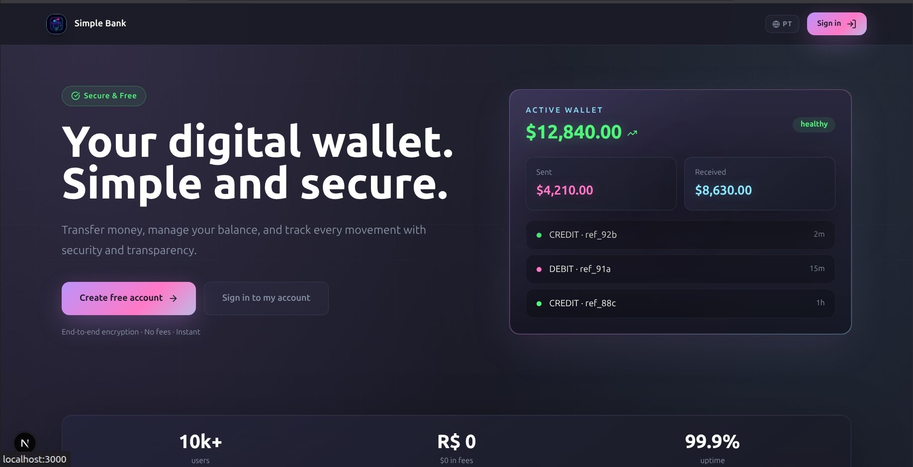
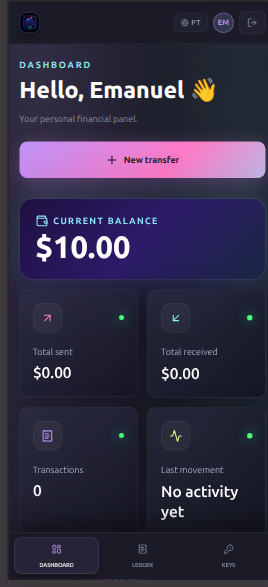
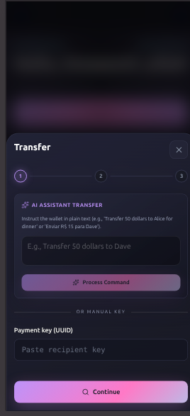
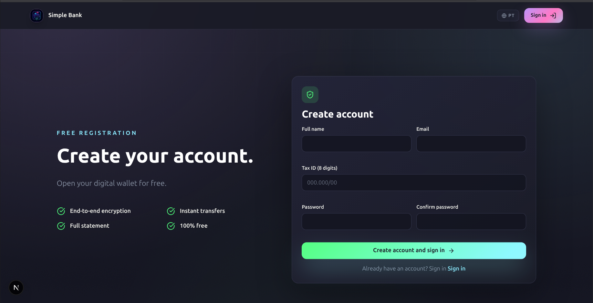

# Simple Bank

<p align="center">
  
</p>

Um projeto de internet banking completo e moderno, focado na experiência do usuário e na arquitetura simplificada, porém robusta, contendo interface Web e Mobile (App), com integrações de inteligência artificial para auxiliar no dia a dia financeiro do usuário. 

## 🚀 Funcionalidades

O Simple Bank se destaca por oferecer funcionalidades bancárias tradicionais unidas a recursos de Inteligência Artificial:

- **Contas e Saldo**: Acompanhamento de saldo e extrato em tempo real.
- **Transferências**: Envio de valores para outras chaves ou por Pix Copia e Cola / QR Code.
- **Gerenciamento de Chaves**: Criação e gestão de chaves Pix para recebimentos rápidos.
- **Análise Inteligente de Transações (IA)**:
  - Avaliação de Risco: IA que pontua cada transação de 0 a 100, indicando transações atípicas e o nível de risco.
  - Categorização Automática: Classificação de categorias e simplificação das descrições.
  - Dicas Financeiras: Avaliações para otimizar os seus gastos baseados na movimentação específica.
- **Consultor Financeiro (IA)**: Widget na tela inicial que analisa os últimos 30 dias de movimentações e oferece dicas personalizadas para economizar ou gerir o orçamento.
- **Comando de Voz / Texto Livre para Transferência (IA)**: Escreva "transferir 50 reais para a chave email@teste.com referente a conta de luz" e o sistema já preenche o formulário para você.

<br>
<p align="center">
   &nbsp; &nbsp; &nbsp;
  
</p>
<br>

## 🛠️ Tecnologias e Arquitetura

O ecossistema é formado por dois frontends e uma API única unificada via Server Actions e Route Handlers (Next.js).

### Web App & API (Next.js 15)
- **Framework:** Next.js (App Router)
- **Estilização:** TailwindCSS (Baseado no tema Dracula) e Radix UI (shadcn/ui adaptado).
- **Gerenciamento de Estado:** React Query (@tanstack/react-query).
- **Banco de Dados:** SQLite, manipulado com Prisma ORM.
- **Autenticação:** Auth.js (NextAuth), usando sessões via JWT / Cookies.
- **Inteligência Artificial:** AI SDK (Vercel) rodando com provedores como Google Generative AI (Gemini).

### Mobile App (React Native + Expo)
- **Framework:** Expo Router
- **Estilização:** NativeWind (TailwindCSS para React Native).
- **Integração:** `@tanstack/react-query` para consumir a API REST exposta pelo Next.js.
- **Autenticação:** O Mobile app gerencia cookies de sessão localmente para se comunicar de forma transparente com as mesmas rotas autenticadas do Web App.

<br>
<p align="center">
  
</p>
<br>

## 📦 Como rodar localmente

### 1. Clonando e preparando a base de dados
```bash
git clone https://github.com/emanuelVINI01/simple-bank.git
cd simple-bank

# Instale as dependências da Web/API
npm install

# Copie o arquivo .env
cp .env.example .env

# Sincronize o banco de dados local com Prisma
npx prisma db push
```

### 2. Configurando as Variáveis de Ambiente (`.env`)
No arquivo `.env`, certifique-se de configurar:
- `AUTH_SECRET`: Uma chave aleatória para assinar os tokens JWT (ex: `openssl rand -base64 32`).
- `GOOGLE_GENERATIVE_AI_API_KEY`: Sua chave de API do Google Gemini para alimentar as funcionalidades de IA.

### 3. Rodando o Servidor Web / API
```bash
npm run dev
```
O portal web e a API estarão disponíveis em `http://localhost:3000`.

### 4. Rodando o App Mobile
Em um terminal separado:
```bash
cd simple-bank-app

# Instale as dependências
npm install

# Inicie o empacotador do Expo
npx expo start
```
No arquivo `.env` do App Mobile, aponte a URL da API para sua máquina local.

## 🤝 Regras e Padrões de Projeto (AGENTS.md)
Este projeto adere fortemente a arquiteturas limpas com foco em **Responsabilidade Única**:
1. **Pages/Screens compõem** (layout e data fetching containers).
2. **Components renderizam** (pequenos e fáceis de ler, com foco na UI).
3. **Hooks controlam** (regras de negócio, integrações via react-query, estados isolados).
4. **i18n** é obrigatório: nenhum texto de interface deve estar *hardcoded* nos componentes (incluindo Mobile).
5. O padrão de cores acompanha fielmente o modelo **Dracula** original, sem desvios para bibliotecas padrão ou bibliotecas UI genéricas.

## 📄 Licença
Distribuído sob a licença MIT. Veja `LICENSE` para mais informações.
