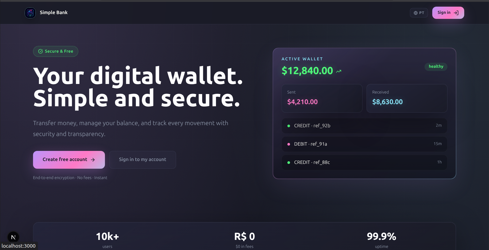
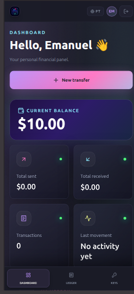
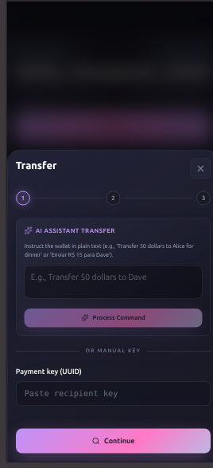
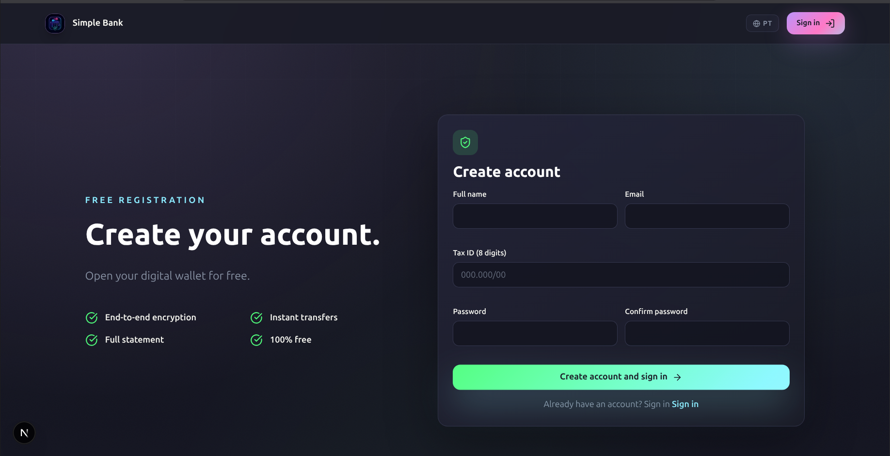

# Simple Bank

<p align="center">
  
</p>

A modern, full-stack digital banking demo focused on user experience and a simple but robust architecture. It ships a Web app (Next.js) and a companion Mobile app (Expo), sharing a single unified API, and layers in Google Gemini-powered AI features for everyday financial tasks: per-transaction risk scoring, spend categorization, a personal budget advisor, and natural-language transfer parsing.

This is a personal portfolio project, not a production service — there's no real money movement behind it, and the "why this project" pitch below is about what the codebase actually does, not manufactured adoption numbers.

## Features

Simple Bank combines traditional banking primitives with a handful of genuinely useful AI features:

- **Accounts & Balance**: Real-time balance and statement tracking.
- **Transfers**: Send money to a payment key, or via a Pix-style copy-paste code / QR code.
- **Key Management**: Create and manage payment keys for fast, secure receiving.
- **AI Transaction Analysis**:
  - Risk Scoring: a model scores every transaction from 0 to 100, flagging atypical activity.
  - Auto-Categorization: transactions are classified into spending categories with a simplified, friendly description.
  - Financial Tips: short, targeted suggestions based on the specific movement.
- **AI Financial Advisor**: a dashboard widget that reviews the last 30 days of activity and suggests ways to save or budget better.
- **Natural-Language Transfers (AI)**: type something like "transfer 50 reais to email@test.com for the electric bill" and the app parses it into a pre-filled transfer.

<br>
<p align="center">
   &nbsp; &nbsp; &nbsp;
  
</p>
<br>

## Tech Stack & Architecture

The project is made up of two frontends sharing a single API, unified via Next.js Route Handlers.

### Web App & API (Next.js)
- **Framework:** Next.js 16 (App Router)
- **Styling:** Tailwind CSS with a fully hand-built UI — no component library (no Radix UI / shadcn) — styled around a dark, glassmorphism-inspired visual identity.
- **State Management:** React Query (`@tanstack/react-query`).
- **Database:** PostgreSQL, accessed through Prisma ORM.
- **Authentication:** Auth.js (NextAuth) with JWT-backed sessions.
- **AI:** Google Gemini via `@google/genai`.

### Mobile App (React Native + Expo)
The `simple-bank-app/` workspace is a companion Expo Router mobile client that talks to the same authenticated Next.js API routes as the web app, styled with NativeWind and using `@tanstack/react-query` for data fetching. It shares the backend's business rules and ledger model, so there is no separate mobile-only API surface.

<br>
<p align="center">
  
</p>
<br>

## Getting Started

### 1. Clone and prepare the database
```bash
git clone https://github.com/emanuelVINI01/simple-bank.git
cd simple-bank

# Install Web/API dependencies
npm install

# Copy the environment file
cp .env.example .env

# Sync the local database with Prisma
npx prisma db push
```

### 2. Configure environment variables (`.env`)
In your `.env` file, make sure to set:
- `DATABASE_URL`: connection string for your PostgreSQL database.
- `AUTH_SECRET`: a random secret used to sign JWTs (e.g. `openssl rand -base64 32`).
- `AUTH_URL`: the base URL of the app (e.g. `http://localhost:3000`).
- `GEMINI_API_KEY`: your Google Gemini API key, used to power the AI features.

### 3. Run the Web app / API
```bash
npm run dev
```
The web app and API will be available at `http://localhost:3000`.

### 4. Run the Mobile app
In a separate terminal:
```bash
cd simple-bank-app

# Install dependencies
npm install

# Start the Expo bundler
npx expo start
```
In the Mobile app's `.env` file, point the API URL to your local machine.

## License
Distributed under the MIT license. See [`LICENSE`](LICENSE) for details.
